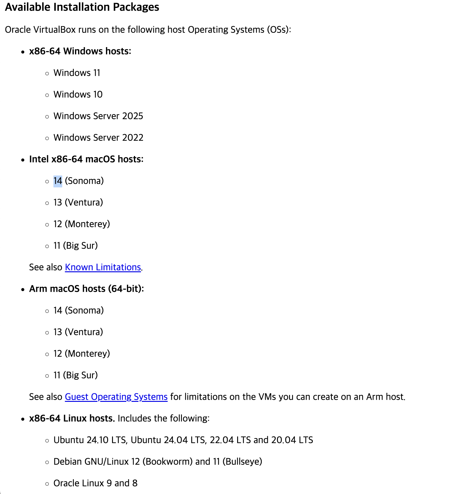
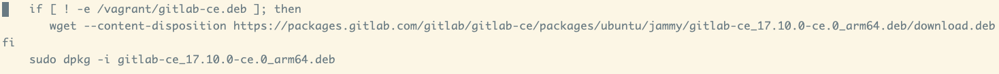
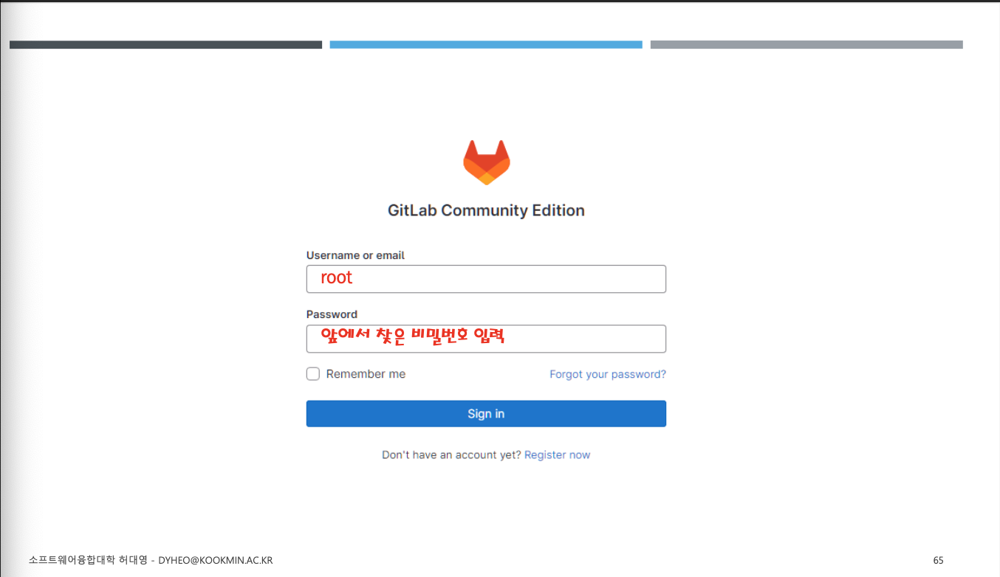
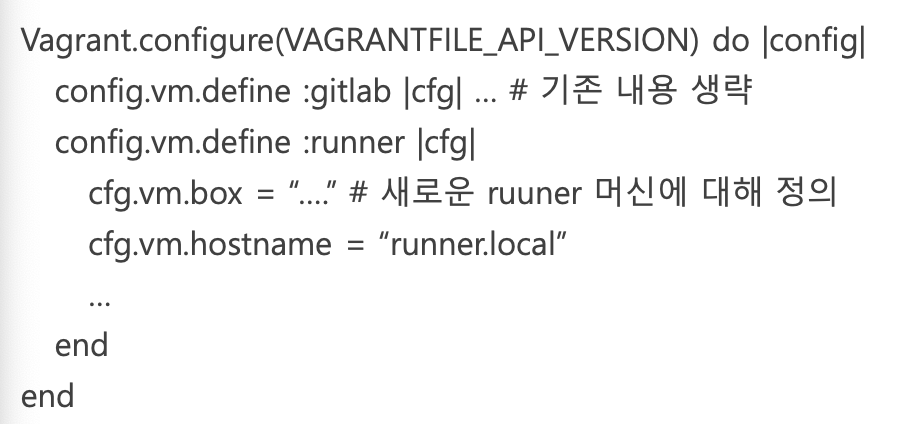
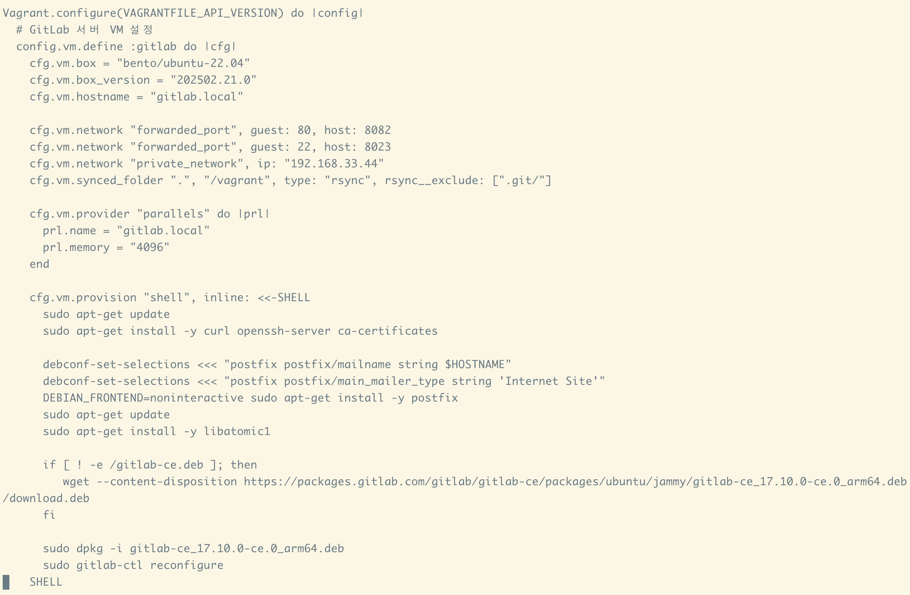
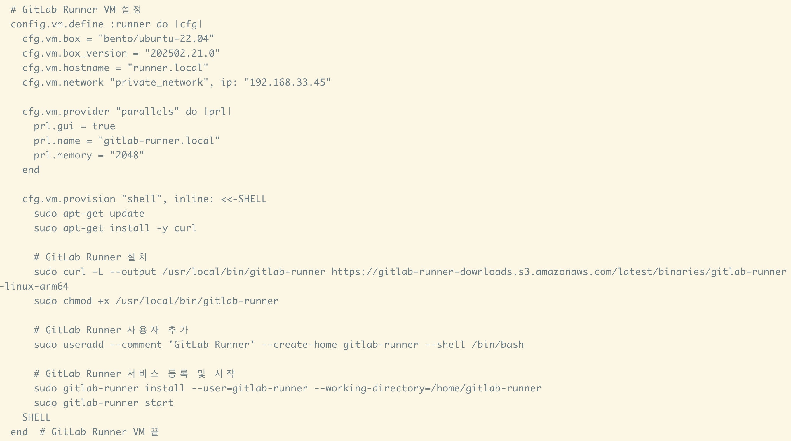
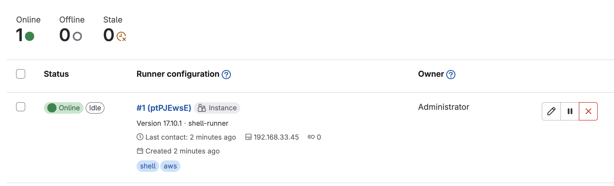
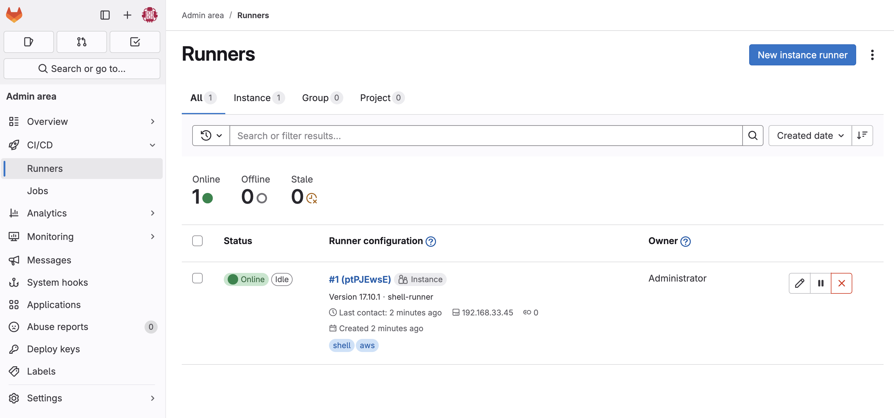

# 1주차 과제 진행사항
- 가상환경 구축: mac, window, linux 다 있음
	- 가상머신-==virtual box== or hyper v 설치: 최신 버전으로
	- 설치 자동화 vagrant
- guest os
	- rocky linux(redhat): 9버전 or 8버전
	- AI 프로젝트에는 ==Ubuntu==: 22.04 or 24.04(아직 최적화 잘 안됨)
- vagrant 파일 만들고 제출
## virtual box 
- 가상머신: virtual box
- os: ubuntu/jammy64 -> 안됨, 현재(2503) virtual box에서는 m 계열 ap 지원 x, only linux 만
- 관련: https://www.virtualbox.org/manual/topics/Introduction.html#host-guest-matrix
- paralles사용 후에 가능했음
## 과제 진행 결과

# 2주차 과제 진행사항 
## issue
- ubuntu/jammy64 사용 시 에러
- `NS_ERROR_FAILURE (0x80004005)`
### 원인: Mac OS 15 미지원
- ~~virtual box 최신 버전: mac os 15 미지원~~
	
- https://www.virtualbox.org/manual/topics/Introduction.html#host-guest-matrix
#### parallels 사용:https://kb.parallels.com/en/122843
- gitlab 초기비번
	- vagrant ssh -c "sudo cat /etc/gitlab/initial_root_password"
	- `63rB+XuWnYB5L1cLvWlToxR3mVhoa572ouhNqxhYBIA=`
- gitlab runner token: `y9msypot9tBS2H2yBtvU`
- parallels 사용 후 전체적으로 큰 문제 없이 진행
	- gitlab-ce 다운 시 경로 문제로 지체 됐음
		- 상기구문 해석: home/vagrant/gitlab-ce가 없으면 다운로드 후 설치
		- ==issue: 수업자료 상 sudo dpkg -i vagrant/gitlab-ce로 입력 시 실제 설치파일 경로 -> /home/vagrant/vagrant/gitlab-ce==
			➡️ dpkg 명령 시 vagrant/ 제거 후 설치 파일명만 입력
### vm gitlab
- 로그인

- CI-CD: gitlab runner 사용
	1. git lab 좌상단의 햄버거 메뉴 클릭 -> runners 클릭
	2. 우측 'register an instance runner' -> register token 사용
	3. 환경 별 runner 관리 코드 존재, ==gitlab vm 을 정의했던 vagrant file에서 함께 관리할 수 있음==
### 하나의 vagrant file에서 복수의 vm 관리
-  강의 자료의 예시
	
	- vm이 둘 이상일 때, config.vm.define 구문을 추가하여 관리(vm이 하나일 때는 별도 정의 x)
	- 위의 예시에서는 gitlab과 runner를 각각 정의
- 실제 과제 수행 vagrant 파일
	- gitlab vm 정의
		
	- runner vm 정의
		
- 각각의 vm은 define으로 vm의 attribute를 정의 후 end
- shell을 이용하여 provision 후 end
- 마지막으로 vagrant.configure을 통해 end
# 3주차 과제 진행사항 
- 과제: gitlab runner 환경 추가 및 교수님 초대
## runner instance 등록

### 1. 2주차에 구성했던 gitlab 환경 준비
- 2주차 시점의 vagrantfile 내에는 이미 runner가 추가되어 있음 -> 주석처리
- `vagrant up`
### runner 환경 준비
- 참조: [[DevOps  Deployment - 03.pdf]]
- 목표: 구성된 gitlab 환경에서 새로운 runner 인스턴스 등록
1. 2주차 시점의 vagrantfile 내에는 이미 gitlab이 추가되어 있음 -> 주석처리
2. repo에 별도 runner 디렉터리 생성 후 vagrantfile 옮기기
```sh
# 명령 실행 시 registration-token 옵션 기입 기능 추가
require 'getoptlong'
opts = GetoptLong.new(
  [ '--registration-token', GetoptLong::OPTIONAL_ARGUMENT ]
)

REGISTRATION_TOKEN=""

opts.each do |opt, arg|
  case opt
    when '--registration-token'
      REGISTRATION_TOKEN=arg
  end
end

VAGRANTFILE_API_VERSION = "2"

Vagrant.configure(VAGRANTFILE_API_VERSION) do |config|

  # GitLab Runner VM 설정
  config.vm.define :runner do |cfg|  
    cfg.vm.box = "bento/ubuntu-22.04"
    cfg.vm.box_version = "202502.21.0"
    cfg.vm.hostname = "ci-runner"
    cfg.vm.network "private_network", ip: "192.168.33.45"  

    cfg.vm.provider "parallels" do |prl| 
      # prl.gui = true 
      prl.name = "ci-runner"
      prl.memory = "2048"
    end

    cfg.vm.provision "shell", inline: <<-SHELL
      sudo apt-get update
      sudo apt-get install -y curl

      # GitLab Runner 설치
      sudo curl -L --output /usr/local/bin/gitlab-runner https://gitlab-runner-downloads.s3.amazonaws.com/latest/binaries/gitlab-runner-linux-arm64
      sudo chmod +x /usr/local/bin/gitlab-runner

      # GitLab Runner 사용자 추가
      sudo useradd --comment 'CI Runner' --create-home ci-runner --shell /bin/bash

      # GitLab Runner 서비스 등록 및 시작
      sudo gitlab-runner install --user=ci-runner --working-directory=/home/ci-runner
      sudo gitlab-runner start

      # Runner 등록 -> 이부분이 runner 등록하는 부분
      sudo gitlab-runner register \
        --non-interactive \
        --url "http://192.168.33.44/" \ #->구성된 git lab의 url
        --registration-token "#{REGISTRATION_TOKEN}" \ #-> 위에서 변수로 받아오는 registration token
        --executor "shell" \
        --description "shell-runner" \
        --maintenance-note "Free-form maintainer notes about this runner" \
        --tag-list "shell,aws" \
        --run-untagged="true" \
        --locked="false" \
        --access-level="not_protected"
    SHELL
  end  # GitLab Runner VM 끝
end
```
3. 명령어 실행
```sh
vagrant --registration-token='gitlab에서 registration token 보고 오기' up
vagrant --registration-token='상동' provision
```
4. 결과: http://localhost:8082/admin/runners
	
